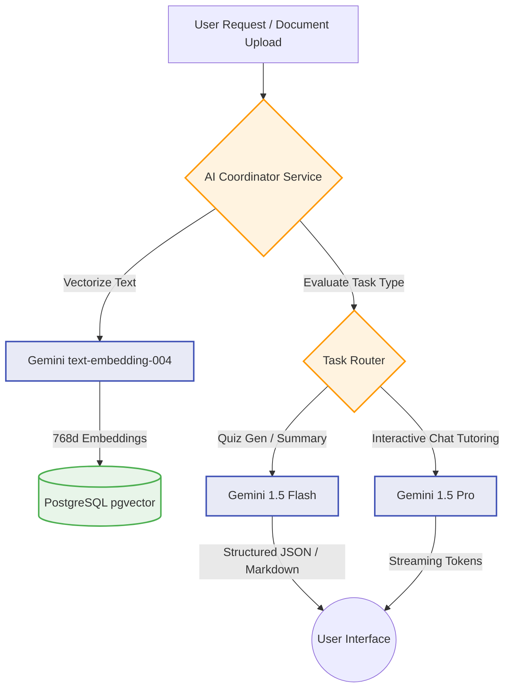
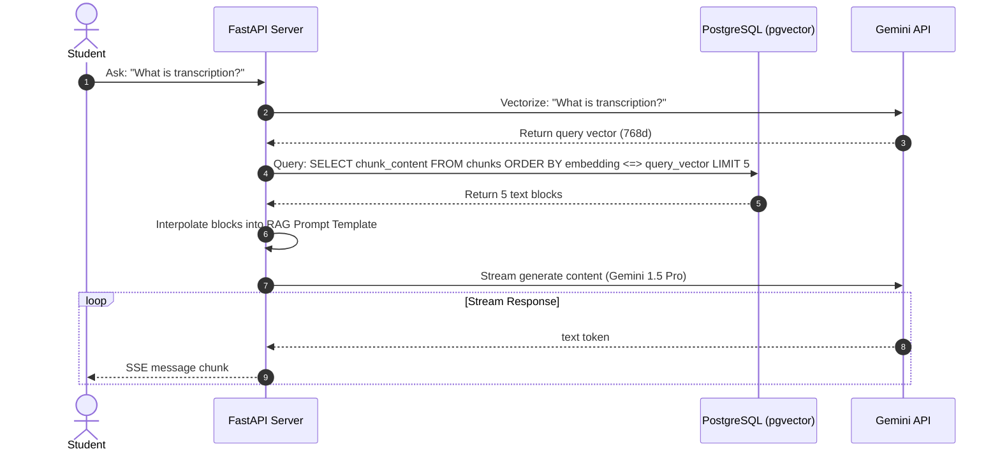

# AI Integration Plan - Study Sphere AI

This document details the AI architecture, LLM settings, prompt engineering strategies, and Retrieval-Augmented Generation (RAG) pipelines for **Study Sphere AI**, using the Google Gemini API suite.

---

## 1. AI Architecture Overview

Study Sphere AI utilizes a dual-model approach designed to balance processing speed, output structuring, and reasoning depth:



### Model Roles:
1. **Gemini 1.5 Flash**: Used for high-volume, structured tasks (generating quizzes, creating summaries, parsing files). Flash provides low latency and supports structured JSON schema enforcement.
2. **Gemini 1.5 Pro**: Used for interactive study chats. Pro handles complex reasoning, multi-hop mathematical tasks, and code analysis.
3. **`text-embedding-004`**: Google's native embedding model (768-dimensional output) used to build the semantic indexes.

---

## 2. AI Features Specifications

### A. AI Study Assistant (Tutor)
* **Objective**: Provide interactive, personalized tutoring sessions on uploaded documents.
* **Capabilities**:
  * Answers student questions based on document context.
  * Formats answers in clear Markdown (supports LaTeX mathematical notation e.g., `$$E=mc^2$$` and code blocks).
  * Prompts the student with interactive questions to verify their understanding.

### B. Notes Summarization
* **Objective**: Compress lengthy notes or textbooks into study guides.
* **Structure of Output**:
  1. *Executive Summary*: A 3-sentence summary of the document.
  2. *Key Concept Map*: Bulleted core subjects covered.
  3. *Glossary*: Definitions of terms found in the note text.

### C. Quiz Generation
* **Objective**: Generate customizable, context-aware multiple-choice assessments.
* **Constraints**: Must return a strict JSON array matching this Pydantic format:
  ```json
  [
    {
      "question": "What is the primary function of DNA replication?",
      "options": ["Synthesize protein", "Copy genetic data", "Produce RNA", "Cell division"],
      "correct_option_index": 1,
      "explanation": "DNA replication copies genetic material to ensure daughter cells receive correct genomic instructions."
    }
  ]
  ```

### D. Personalized Learning Support (Recommender)
* **Objective**: Guide the student's study plan based on performance logs.
* **Input**: Last 5 quiz attempts + overdue task schedules.
* **Action**: Generates a custom prompt suggesting areas to review (e.g., *"You scored 40% on DNA structure; try studying page 4 of your biology notes again."*).

---

## 3. LLM Integration Settings

We utilize the official Python **`google-generativeai`** SDK.

| Task | Target Model | Temperature | System Instruction / Constraints | Output Format |
| :--- | :--- | :--- | :--- | :--- |
| **Ingestion** | `text-embedding-004` | N/A | Generates 768-dimension vectors. | Vector Float Array |
| **Summarize**| `gemini-1.5-flash` | `0.2` | Focus on core concepts. Limit output length. | Markdown Text |
| **Quiz Gen** | `gemini-1.5-flash` | `0.0` (Deterministic) | Enforced Pydantic Schema. | Structured JSON |
| **Chat Tutor**| `gemini-1.5-pro` | `0.7` (Creative/Warm) | Act as an encouraging tutor. | Streamed Markdown |

---

## 4. Prompt Engineering Strategy

To ensure high-quality outputs, we use distinct prompt templates:

### A. RAG Tutor Prompt Template
```text
System:
You are Study Sphere AI, a helpful, encouraging, and intelligent academic tutor. 
Use the provided study context blocks to answer the student's query. 
Follow these formatting rules:
1. Write math equations in standard LaTeX notation ($...$ or $$...$$).
2. If the context does not contain the answer, state that you cannot find it in the uploaded notes, but offer to explain based on general knowledge (clearly separating local context from external knowledge).
3. Keep answers clear and digestible. Use bullet points for steps.

Study Context:
======================
{context_chunks}
======================

Student Query: {user_query}
```

### B. Structured Quiz Prompt Template
```text
System:
Generate a {count}-question multiple-choice quiz based ONLY on the provided context.
Ensure questions test critical comprehension, not simple keyword matching.
Each question must contain exactly 4 options.
You must output a JSON object matching this schema:
{schema_definition}

Study Context:
======================
{context_text}
======================
```

---

## 5. Document Processing Workflow

When a student uploads a study document, the backend executes the following processing steps:

1. **Text Extraction**:
   - PDFs are parsed using `pypdf` or `pdfplumber` to extract clean textual content.
   - Text files are read directly.
2. **Text Cleaning**:
   - Replaces redundant line breaks and strips headers/footers using regex matching.
3. **Semantic Chunking**:
   - Chunks are created using a recursive text splitter with a target **chunk size of 1000 characters** and a **200-character overlap**.
   - Overlaps ensure context is preserved when splitting paragraphs.
4. **Vector Generation**:
   - Chunks are sent concurrently in batches to the `text-embedding-004` endpoint to optimize upload speed.
5. **Database Storage**:
   - Text chunks and corresponding float arrays are saved directly to the database.

---

## 6. RAG (Retrieval-Augmented Generation) Workflow



1. **Query Embeddings**: Convert user's question into a semantic vector.
2. **Similarity Fetch**: Query PostgreSQL for the top 5 chunks with the lowest Cosine Distance to the query vector.
3. **Prompt Injection**: Construct the final prompt by replacing `{context_chunks}` and `{user_query}` in the template.
4. **Streaming Response**: Feed the assembled prompt to Gemini 1.5 Pro and stream the response tokens back to the client interface using Server-Sent Events (SSE).

---

## 7. How AI Connects with Backend

AI capabilities are encapsulated in `app/services/chat_service.py` and `app/services/quiz_service.py`:

* **Environment Setup**: The backend loads `GEMINI_API_KEY` from `.env` using Pydantic Settings, configuring the SDK client on start.
* **Async IO Calls**: AI API requests are asynchronous, utilizing `await client.generate_content_async` to prevent blocking the event loop.
* **Schema Validation**: The backend parses quiz JSON payloads returned by Gemini through Pydantic validators (`QuizSchema.model_validate_json(response_text)`) before saving them to the database, ensuring schema stability.
