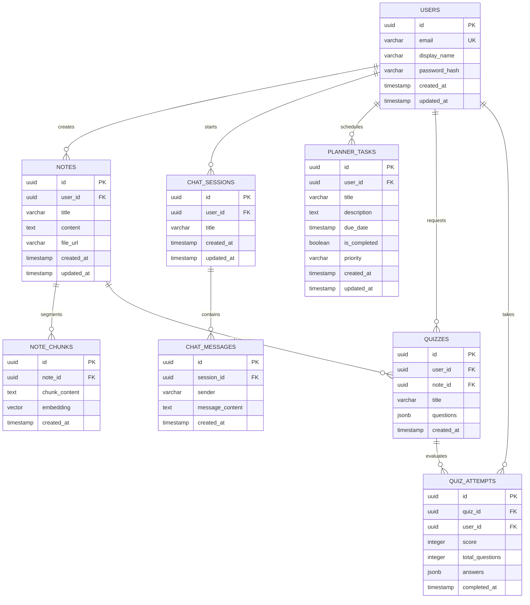

# Database Design - Study Sphere AI

This document details the database architecture designed to support the core features of **Study Sphere AI**. It outlines our technology selection rationale, entity schemas, relationship models, and backend connection details.

---

## 1. Database Selection Explanation

For a hackathon setting and subsequent production scaling, we select **PostgreSQL** as our primary relational database, supplemented by the **`pgvector`** extension for vector similarity search.

### Rationale:
1. **Unified Relational and Semantic Storage**: Instead of maintaining two separate database systems (e.g., PostgreSQL for users/planner and Pinecone/Milvus for AI embeddings), PostgreSQL with `pgvector` allows us to query metadata and vector embeddings in a single SQL statement. This reduces system complexity and keeps our stack minimal for hackathon presentation.
2. **JSONB Support**: PostgreSQL offers robust JSONB fields. This is perfect for storing dynamic structure payloads like generated quiz questions/answers, avoiding complex multi-table joins for quiz schemas.
3. **Acid Compliance**: Ensures absolute reliability for user progress tracking, planner schedules, and user credentials.
4. **HNSW Vector Indexing**: `pgvector` supports Hierarchical Navigable Small World (HNSW) indexing, which provides sub-millisecond approximate nearest neighbor search times.

---

## 2. Main Entities / Tables

To support the requested features, the database consists of the following 8 core tables:

1. **`users`**: Manages user profiles and authentication details.
2. **`notes`**: Stores user-uploaded notes, lecture transcripts, and textbooks.
3. **`note_chunks`**: Stores segmented note pieces alongside high-dimensional vector embeddings for RAG.
4. **`chat_sessions`**: Groupings of conversations with the AI tutor.
5. **`chat_messages`**: Dialogue history between the student and the AI tutor.
6. **`planner_tasks`**: Tasks, agendas, priorities, and study plans.
7. **`quizzes`**: AI-generated assessment records containing structured questions.
8. **`quiz_attempts`**: Evaluation logs recording student responses, completion dates, and grades.

---

## 3. Table Attributes & Schema Definition

Below is the detailed schema structure for each table.

### 1. `users`
Tracks registered students.
* `id`: `UUID` (Primary Key, default `gen_random_uuid()`)
* `email`: `VARCHAR(255)` (Unique, Indexed, Not Null)
* `display_name`: `VARCHAR(100)` (Nullable)
* `password_hash`: `VARCHAR(255)` (Not Null, unless relying entirely on OAuth)
* `created_at`: `TIMESTAMP` (Default `NOW()`)
* `updated_at`: `TIMESTAMP` (Default `NOW()`)

### 2. `notes`
Stores study materials and imported text.
* `id`: `UUID` (Primary Key)
* `user_id`: `UUID` (Foreign Key -> `users.id`, Cascade Delete)
* `title`: `VARCHAR(255)` (Not Null)
* `content`: `TEXT` (Not Null)
* `file_url`: `VARCHAR(512)` (Nullable - points to S3/Cloud Storage if applicable)
* `created_at`: `TIMESTAMP` (Default `NOW()`)
* `updated_at`: `TIMESTAMP` (Default `NOW()`)

### 3. `note_chunks`
Stores divided text chunks and embeddings for context retrieval.
* `id`: `UUID` (Primary Key)
* `note_id`: `UUID` (Foreign Key -> `notes.id`, Cascade Delete)
* `chunk_content`: `TEXT` (Not Null)
* `embedding`: `VECTOR(768)` (Not Null - 768 dimensions matching Gemini's `text-embedding-004`)
* `created_at`: `TIMESTAMP` (Default `NOW()`)

### 4. `chat_sessions`
Organizes tutoring conversations by session topic.
* `id`: `UUID` (Primary Key)
* `user_id`: `UUID` (Foreign Key -> `users.id`, Cascade Delete)
* `title`: `VARCHAR(255)` (Default 'New Chat')
* `created_at`: `TIMESTAMP` (Default `NOW()`)
* `updated_at`: `TIMESTAMP` (Default `NOW()`)

### 5. `chat_messages`
Stores individual chat bubbles within a session.
* `id`: `UUID` (Primary Key)
* `session_id`: `UUID` (Foreign Key -> `chat_sessions.id`, Cascade Delete)
* `sender`: `VARCHAR(20)` (Not Null, Check Constraint: `sender IN ('user', 'assistant')`)
* `message_content`: `TEXT` (Not Null)
* `created_at`: `TIMESTAMP` (Default `NOW()`)

### 6. `planner_tasks`
Supports the student study planner.
* `id`: `UUID` (Primary Key)
* `user_id`: `UUID` (Foreign Key -> `users.id`, Cascade Delete)
* `title`: `VARCHAR(255)` (Not Null)
* `description`: `TEXT` (Nullable)
* `due_date`: `TIMESTAMP` (Not Null)
* `is_completed`: `BOOLEAN` (Default `FALSE`)
* `priority`: `VARCHAR(10)` (Default 'medium', Check Constraint: `priority IN ('low', 'medium', 'high')`)
* `created_at`: `TIMESTAMP` (Default `NOW()`)
* `updated_at`: `TIMESTAMP` (Default `NOW()`)

### 7. `quizzes`
Stores AI-generated quizzes derived from user notes.
* `id`: `UUID` (Primary Key)
* `user_id`: `UUID` (Foreign Key -> `users.id`, Cascade Delete)
* `note_id`: `UUID` (Foreign Key -> `notes.id`, Set Null)
* `title`: `VARCHAR(255)` (Not Null)
* `questions`: `JSONB` (Not Null) 
  * *Structure*: `[{"question_text": "", "options": ["A", "B", "C", "D"], "correct_index": 0, "explanation": ""}]`
* `created_at`: `TIMESTAMP` (Default `NOW()`)

### 8. `quiz_attempts`
Records the student's performance logs.
* `id`: `UUID` (Primary Key)
* `quiz_id`: `UUID` (Foreign Key -> `quizzes.id`, Cascade Delete)
* `user_id`: `UUID` (Foreign Key -> `users.id`, Cascade Delete)
* `score`: `INTEGER` (Not Null)
* `total_questions`: `INTEGER` (Not Null)
* `answers`: `JSONB` (Not Null) 
  * *Structure*: `[{"question_index": 0, "selected_index": 2, "is_correct": false}]`
* `completed_at`: `TIMESTAMP` (Default `NOW()`)

---

## 4. Entity Relationship Diagram (ER Diagram)

This diagram outlines table relationships, showing primary and foreign key structures.



---

## 5. How Database Connects with Backend

In our FastAPI backend application, connection and operations will be managed using a set of modern Python tools:

1. **SQLModel**: An ORM framework that merges Pydantic and SQLAlchemy. It guarantees that our data schema models are identical to our data validation schemas, cutting code duplication by 50%.
2. **AsyncPG**: An extremely fast, asynchronous PostgreSQL client library for Python. This ensures that the FastAPI application does not block during database I/O, maintaining high performance under load.
3. **Database Connection Pooling**:
   * Connection pools are opened on application startup (`@app.on_event("startup")`) and safely disposed of on shutdown.
   * `SQLAlchemy QueuePool` will maintain active connection threads, preventing backend exhaustion during parallel queries.
4. **Dependency Injection**:
   * FastAPI's dependency injection system will yield an active database session (`get_session()`) per request, automatically rolling back transactions in case of exceptions and closing connections upon request completion.

```python
# Conceptual Dependency Injection Pattern
async def get_session() -> AsyncSession:
    async with AsyncSession(engine) as session:
        yield session

@app.post("/api/notes/")
async def create_note(note_data: NoteCreate, db: AsyncSession = Depends(get_session)):
    db_note = Note.model_validate(note_data)
    db.add(db_note)
    await db.commit()
    await db.refresh(db_note)
    return db_note
```
