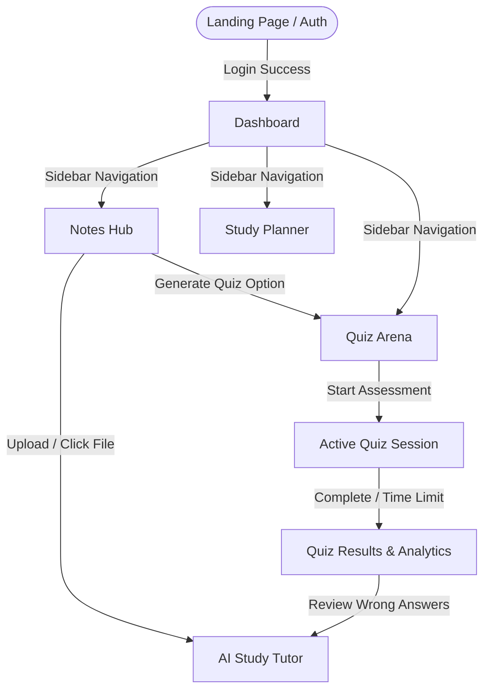

# Frontend Application Plan - Study Sphere AI

This document outlines the frontend application blueprint for **Study Sphere AI**, using a React + Vite stack. It outlines the modular folder structure, pages, navigation user journeys, premium UI guidelines, and client state architecture.

---

## 1. Frontend Folder Structure

For a clean, modular React + Vite codebase, we will implement the following file structure:

```text
frontend/
├── public/                     # Static assets (logos, favicons, illustrations)
├── src/
│   ├── assets/                 # SVGs, icons, and localized CSS animations
│   ├── components/             # Reusable UI components
│   │   ├── common/             # Base elements (Button, Input, Card, Modal, Loader)
│   │   ├── dashboard/          # MetricsCard, StreakCalendar, QuickTaskWidget
│   │   ├── notes/              # FileUploader, NoteCard, DocumentViewer
│   │   ├── tutor/              # ChatBubble, StreamResponse, SuggestionChips
│   │   └── quiz/               # QuestionCard, QuizTimer, ResultsChart
│   ├── hooks/                  # Custom hooks (useAuth, useKeyPress, useStreamingChat)
│   ├── layouts/                # Base layouts (AppLayout, DashboardLayout, AuthLayout)
│   ├── pages/                  # Routed pages (Auth, Dashboard, Notes, Tutor, Planner, Quiz)
│   ├── services/               # REST API calls (Axios client setup, endpoints wrappers)
│   ├── store/                  # Client global state stores (useAppStore, useQuizStore)
│   ├── styles/                 # Global styling (variables.css, index.css, Glass.css)
│   ├── utils/                  # Helper utilities (dateUtils, textTruncator)
│   ├── App.jsx                 # Routing configuration (React Router DOM)
│   └── main.jsx                # React DOM render entry point
├── .env.example                # Template for environment variables (VITE_API_URL)
├── index.html                  # HTML entry point (pointing to Google Fonts)
├── package.json                # Project dependencies and script runner commands
└── vite.config.js              # Vite configuration (aliases, dev server settings)
```

---

## 2. Required Pages & Components

### A. Login / Register Page (`/auth`)
* **Purpose**: Handles student authentication.
* **Core Components**:
  * `GlassAuthCard`: Semi-transparent authentication panel centered on a mesh gradient backdrop.
  * `OAuthButtonList`: Google, GitHub authentication handlers.
  * `CredentialsForm`: Interactive signup/signin form with validation feedback.

### B. Dashboard Page (`/`)
* **Purpose**: Centralized student landing center summarizing performance and daily tasks.
* **Core Components**:
  * `StreakWidget`: Visual tracker showing consecutive active study days.
  * `RecentNotesGrid`: Catalog list of the 3 most recently opened documents.
  * `PlannerQuickList`: Compact view of tasks due within the next 24 hours.
  * `DailyProgressRing`: Circular SVG progress bar showing study goal percentages.

### C. Notes & Document Hub (`/notes`)
* **Purpose**: Storage catalog for study material upload and review.
* **Core Components**:
  * `DropzoneUploader`: Drag-and-drop file uploader supporting PDF and TXT. Includes a file scanning progress bar.
  * `NoteEditor`: Markdown or rich-text editor for taking notes adjacent to documents.

### D. AI Study Tutor (`/tutor`)
* **Purpose**: Split-screen workspace for reading notes and chatting with the AI.
* **Core Components**:
  * `SplitPaneLayout`: Resizable horizontal panels separating document and chat.
  * `DocumentViewer`: Left panel displaying note text with line highlighter.
  * `ChatWindow`: Right panel featuring chat history, support for LaTeX parsing, and code syntax highlighting.
  * `SuggestionChips`: Small clickable bubbles recommending follow-up questions (e.g., *"Summarize Chapter 2"*).

### E. Study Planner (`/planner`)
* **Purpose**: Calendar and list view for organizing tasks and study schedules.
* **Core Components**:
  * `KanbanBoard`: Columns for 'To Do', 'In Progress', and 'Completed'.
  * `TaskModal`: Form to create/edit tasks (title, notes, due date, priority tags).

### F. Quiz Arena (`/quiz`)
* **Purpose**: Assessment playground where students test their knowledge.
* **Core Components**:
  * `QuizSetup`: Configures active context, question count, and difficulty.
  * `QuizArenaActive`: Rendered question slides with multiple choice buttons, progress bar, and timer.
  * `QuizResultsViewer`: Breakdown of correct answers, score percentage, and detailed explanations of missed items.

---

## 3. User Navigation Flow



1. **Authentication Gate**: User logs in/registers and is redirected to the main dashboard layout.
2. **Global Sidebar**: A fixed glassmorphic sidebar allows one-click navigation between the Dashboard, Notes, Planner, and Quizzes.
3. **Workspace Deep Linking**: Clicking *"Study this note"* in the Notes Hub redirects the user to the `/tutor?noteId=XYZ` route, pre-loading that note into the split-screen viewer.
4. **Adaptive Context**: While chatting or taking a quiz, students can easily pivot back to the study material.

---

## 4. UI Design Guidelines (Premium Aesthetics)

To ensure Study Sphere AI stands out, we will use a **premium dark glassmorphic design language**.

### CSS Custom Properties (Theme tokens)
```css
:root {
  /* Colors */
  --bg-deep: #0b0f19;         /* Dark cosmic backdrop */
  --bg-surface: #131b2e;      /* Semi-opaque card background */
  --accent-primary: #6366f1;  /* Electric Indigo */
  --accent-secondary: #06b6d4;/* Neon Cyan */
  --accent-success: #10b981;  /* Vibrant Emerald */
  --accent-warning: #f59e0b;  /* Amber */
  --text-main: #f8fafc;       /* Crisp White */
  --text-muted: #94a3b8;      /* Cool Slate Gray */
  
  /* Borders and Glassmorphism */
  --border-glass: rgba(255, 255, 255, 0.05);
  --bg-glass: rgba(19, 27, 46, 0.7);
  --shadow-glass: 0 8px 32px 0 rgba(0, 0, 0, 0.37);
  --blur-glass: backdrop-filter: blur(12px);
  
  /* Transitions */
  --transition-smooth: all 0.3s cubic-bezier(0.4, 0, 0.2, 1);
}
```

### Visual Guidelines:
* **Backgrounds**: Mesh gradients shifting softly from deep blues to indigo (e.g., `radial-gradient(at top, #1e293b, #0f172a)`).
* **Borders**: All cards should use a `1px` translucent solid border (`var(--border-glass)`) to pop from the dark background.
* **Hover State Animations**: Buttons and interactive cards should scale slightly (`scale(1.02)`) and shift shadow colors when hovered.
* **Typography**: Outfit font for headlines (clean, modern geometric) and Inter for readable body text.

---

## 5. State Management Approach

We split our state management into client state and server cache to optimize performance:

### 1. Global Client State (Zustand)
Zustand is chosen for its minimal boilerplate and simple hooks integration.
* **`useAppStore`**: Stores active authentication status, selected theme, and sidebar open state.
* **`useWorkspaceStore`**: Track the active document (`activeNoteId`) being studied, and sidebar expansion status in the tutor layout.
* **`useAudioStore`**: Manages voice-to-text / text-to-speech toggles for speech-enabled study helper features.

### 2. Server State & Caching (TanStack Query / React Query)
React Query handles fetching, caching, synchronization, and automatic background re-validation of server data:
* **Queries**:
  * `useQuery(['notes'])` — Fetches the student's notes directory catalog.
  * `useQuery(['planner_tasks'])` — Fetches active planner milestones.
  * `useQuery(['chat_history', sessionId])` — Fetches dialogue histories.
* **Mutations**:
  * `useMutation(createNote)` — Handles note upload/creation, triggers an automatic invalidation of the `notes` query keys.
  * `useMutation(completeTask)` — Performs optimistic updates on planner checkmarks for zero-latency interactions.
