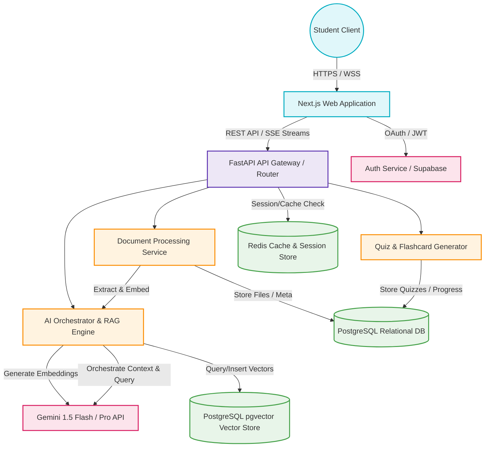
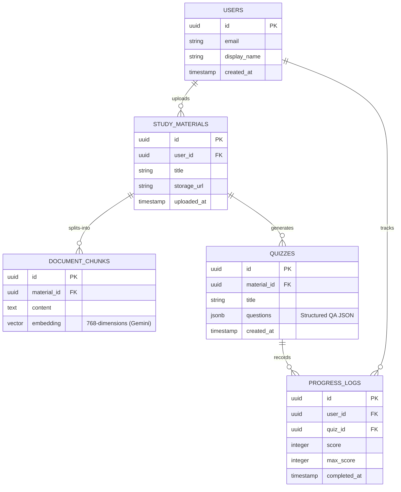
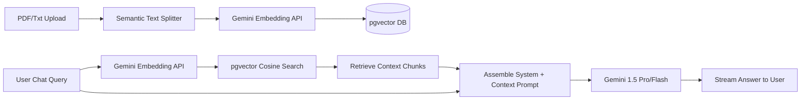
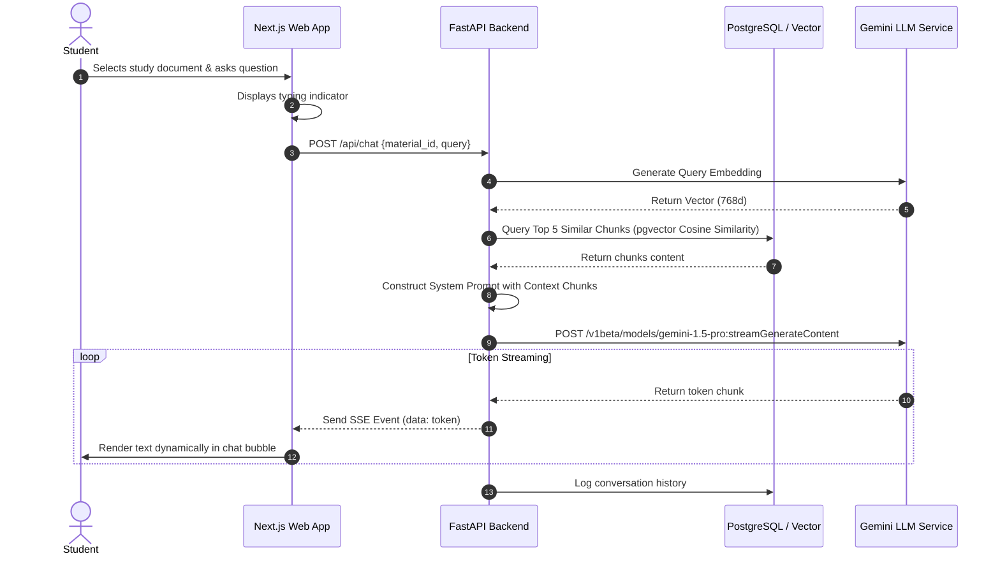

# System Architecture Design - Study Sphere AI

This document provides a comprehensive overview of the system architecture for **Study Sphere AI**, a premium, AI-driven personalized learning companion. It is structured to serve as both an engineering blueprint and a hackathon technical report.

---

## 1. Overall Architecture Overview

Study Sphere AI implements a **Three-Tier decoupled architecture** designed for high responsiveness, real-time interactivity, and seamless AI model orchestration. The architecture separates the user presentation, backend business logic, and semantic/relational data persistence.

### Key Architectural Pillars
1. **Dynamic Presentation**: Multi-device responsive dashboard featuring glassmorphic design and real-time state synchronization.
2. **Asynchronous Business Logic**: Non-blocking Python FastAPI backend utilizing async/await, providing low latency and SSE (Server-Sent Events) streaming.
3. **Hybrid Semantic Storage**: A single database engine (PostgreSQL) handling both relational application metadata and vector embeddings (via `pgvector`) to simplify the transaction scope and data model.
4. **AI Orchestration**: Custom RAG (Retrieval-Augmented Generation) pipeline interacting with Gemini APIs for fast summarization and deep logical reasoning.

---

## 2. Frontend Architecture

The frontend is built for performance, rich micro-animations, and high usability. 

* **Framework**: Next.js 14+ (App Router) with TypeScript.
* **Styling**: Vanilla CSS with custom modern variables (CSS Custom Properties) for a custom glassmorphism visual design (blur, translucent borders, dark/light theme variables).
* **State Management**: 
  * **Zustand**: Lightweight global state for user sessions, active document metadata, and chat/quiz progress.
  * **TanStack Query (React Query)**: Handles server-state caching, automatic revalidation, and optimistic updates.
* **Component Design**: Following Atomic Design principles:
  * *Atoms*: Buttons, Inputs, Tooltips, Badges.
  * *Molecules*: FormFields, QuizCards, MessageBubbles.
  * *Organisms*: DocumentUploader, SidebarNavigation, ChatWindow.
  * *Templates / Pages*: DashboardLayout, WorkspaceLayout.

---

## 3. Backend Architecture

The backend operates as a modular monolith, allowing logical separation of services that can easily transition to microservices if scaled.

* **Framework**: FastAPI (Python 3.11+) leveraging Pydantic v2 for robust input validation.
* **Layered Structure**:
  * **API Controllers (Routers)**: Define REST endpoints and Server-Sent Event (SSE) endpoints.
  * **Service Layer**: Implements core business logic (e.g., document parsing, quiz scoring).
  * **AI Orchestrator**: Manages chunking, retrieval, prompt assembly, and LLM interaction.
  * **Repository Layer**: Data access objects using SQLModel / SQLAlchemy for type-safe database queries.
* **Concurrency**: Asyncio event loop for handling high-concurrency requests, network I/O, and concurrent LLM requests.

---

## 4. Database Architecture

To ensure high performance and maintainable migrations, the data tier uses a hybrid approach:

* **Relational Storage**: PostgreSQL hosts user profiles, document cataloging, quiz generation results, and user performance analytics.
* **Vector Storage**: The `pgvector` extension stores high-dimensional chunk embeddings. An **HNSW (Hierarchical Navigable Small World)** index is applied on the embedding column for high-speed, sub-millisecond semantic search similarity queries.
* **Caching Layer**: Redis keeps short-term cache for LLM responses to repeated user queries and maintains user rate limits.

---

## 5. AI Integration Architecture

The heart of Study Sphere AI is its semantic engine, utilizing a RAG workflow:

* **Text Chunking**: Recursive character-based splitting with a 1000-character window and 200-character overlap, optimized to maintain contextual coherence.
* **Embeddings**: `text-embedding-004` (768 dimensions), providing a rich semantic representation.
* **Retrieval Strategy**: 
  * **Hybrid Search**: Combining keyword search (PostgreSQL `tsvector` / BM25) and semantic search (Cosine Similarity via pgvector).
  * **Reranking**: Utilizing a lightweight cross-encoder to select the top 5 most relevant chunks for the LLM context window.
* **Generation**:
  * **Gemini 1.5 Flash**: Orchestrates fast structured outputs like generating standard multiple-choice quizzes, flashcards, and outline generation.
  * **Gemini 1.5 Pro**: Powers the interactive AI tutor, facilitating logical walkthroughs and answering user queries that require complex multi-hop reasoning.

---

## 6. Data Flow Between Components

### A. Document Upload & Ingestion Flow
1. **User** uploads a PDF textbook via the **Next.js Web App**.
2. **Next.js** transmits the file as `multipart/form-data` to the **FastAPI Backend**.
3. **FastAPI** saves the raw file to secure object storage and initiates an asynchronous background ingestion task.
4. **Ingestion Task** extracts clean text, partitions it into chunks, and requests vector embeddings from the **Gemini Embedding Service**.
5. The resulting vectors and text chunks are persisted in **PostgreSQL (`pgvector`)**.
6. The frontend receives a success notification via a WebSocket or SSE connection.

### B. Study Quiz Generation Flow
1. **User** requests a 10-question quiz on a specific topic within their uploaded document.
2. **FastAPI** fetches relevant text chunks using semantic search.
3. The **AI Orchestrator** formats the retrieved text into a detailed prompt requesting structured JSON matching a predefined Pydantic schema (e.g., questions, options, correct answer, and detailed explanations).
4. **Gemini 1.5 Flash** processes the prompt and returns the structured JSON.
5. The backend parses, validates, and stores the quiz in **PostgreSQL**, returning the payload to the **Next.js Client**.

---

## 7. User Interaction Flow

This interaction flow guarantees that the student receives sub-second feedback via streaming responses, even when querying massive textbooks.
